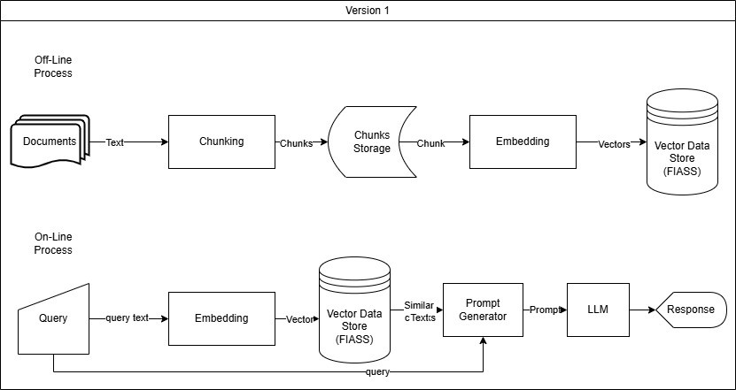

در نسخه اول میخواهیم سیستم RAG ساده را پیاده سازی کنیم. در پیاده سازی ما از [`langchain`](https://www.langchain.com/) استفاده خواهیم کرد که یک فریمورک برای ایجاد اپلیکیشن های LLM برای ما آماده کرده است و ما میتوانیم از ماژول های آماده استفاده کنیم و یک سیستم RAG بهینه ایجاد کنیم.
# معماری سیستم

# اجزا سیستم
### پیش پردازشگر داده
ما برای پردازش داده ها نیاز به ماژول پیش پردازشگری داریم که داده ها را برای سیستم پاکسازی و آماده کند. در نسخه اول تمرکز روی پیش پردازشگر نیست و میتوانیم با عملیات های اولیه این ماژول را پیاده سازی کنیم.
### چانکینگ
متن های طولانی باید به قسمت های کوچکتر شکسته شوند تا حجم زیاد اطلاعات مدل را گیج نکند و مدل بتواند روی قسمت مهم تمرکز کند. البته هر قسمت باید تا آخر جمله برود و نباید متنی از وسط جمله شکسته شود و جمله ای ناقص نماند.
### تعبیه
هر چانک باید بر اساس یک مدل که از زبان فارسی درک دارد به بردار عددی تبدیل شود تا بتوانیم با الگوریتم های بازیابی آن ها را بازیابی کنیم. مدل اولیه انتخابی ما [`ParsBERT`](https://huggingface.co/HooshvareLab/bert-fa-zwnj-base) بوده که براساس تجربه درک خوبی از داده های فارسی دارد.
### مخزن برداری
برای ذخیره و بازیابی بردار ها از پایگاه داده `FAISS` استفاده خواهیم کرد که قابلیت اعمال انواع الگوریتم های بازیابی را دارد.
### تولید پاسخ
برای تولید ما باید از یک مدل زبانی به که به صورت محلی اجرا میشود استفاده کنیم. پس از تحقیق و بررسی متوجه شدیم مدل `Gemma` در تعامل به زبان فارسی از بقیه گزینه ها عملکرد بهتری دارد و نسخه ای که با منابع ما سازگار است [`Gemma3:4b`](https://ollama.com/library/gemma3) میباشد و ما آن را تحت [`Ollama`](https://ollama.com/) اجرا خواهیم کرد.
