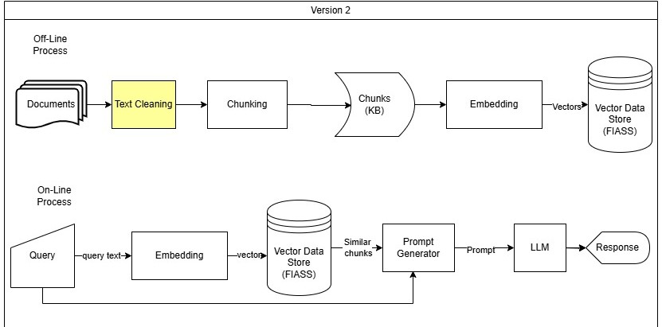

در ورژن یک که سیستم RAG ساده پیاده شد مشکلاتی وجود دارد که راه حل هایی برای آن ها ارائه کردیم.
# معماری سیستم

# جداسازی فاز آفلاین و آنلاین
اولین مشکل این است که همه اجزا سیستم یا پراکنده یا به هم متصل هستند و کار برای ایجاد فاز آفلاین به صورت جداگانه سخت است. همچنین برای استقرار فاز آنلاین روی سرور مجبوریم فاز آفلاین را نیز درگیر کنیم. در نتیجه باید یک ماژول بندی انجام داد که این دو فاز از هم جدا شوند و دو ماژول جدا و اصلی برای ارائه کار های آفلاین و آنلاین سیستم ارائه شود.
# پاکسازی داده ها
در نسخه اول پاسخ های مدل نادرست یا ناقص است که ناشی از نویز درون داده ها و بازیابی ضعیف که دلیل آن استاندارد نبودن داده ها است. در نتیجه باید داده ها پاکسازی و نویز زدایی بشوند.
# خروجی Stream
همچنین تولید پاسخ توسط مدل طول میکشد و برای دریافت پاسخ باید انتظار زیادی بکشیم که معلوم نیست پاسخ ارزش صبر را دارد یا خیر! برای بهبود این مشکل باید سیستم را به سمتی ببریم که تولید خروجی به صورت استریم و توکن توکن باشد تا بتوانیم همزمان با تولید پاسخ آن را مشاهده کنیم.