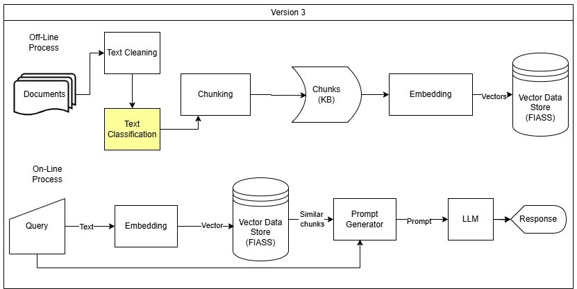

در نسخه 2 با وجود بهبود عملکرد مدل روی داده های تست، همچنان مدل به سوالات پاسخ های مورد انتظار را نمیدهد. پاسخ ها به ظاهر درست هستند اما به دلیل ابهام در کوئری بازیابی به درستی انجام نشده است. مثلا آیین نامه های مربوط به دانشجوی کارشناسی ارشد برای دانشجویان کارشناسی بازیابی میشود و در کوئری و چانک مربوطه ذکر نشده که دقیقا مخاطب چه کسی است. 
# معماری سیستم

# دسته بندی
برای حل این مشکل ایده های پیشنهادی زیر وجود دارند:
- دسته بندی متن 
- افزودن متادیتا تا 3 سطح
	1. دسته
	2. مخاطب
	3. مخاطب خاص

چالشی که وجود دارد هنوز هم ابهام کوئری رفع نخواهد شد و ما بعد از پیاده سازی نسخه 3 فرض را بر این داریم که کوئری بدون ابهام است و برهمین اساس سیستم را ارزیابی خواهیم کرد.